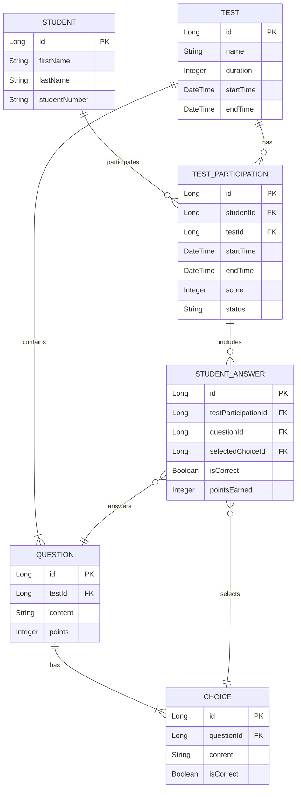

# Student Test Service

I have deployed the application my server. You can access the Swagger API Documentation using the link below:
Swagger API Documentation: [https://doping.kirac.dev/swagger-ui/index.html](https://doping.kirac.dev/swagger-ui/index.html)

## Description
Doping Technology Case Study. Simple Rest API for managing tests and students.

## Features
- Create, read, update, and delete tests
- Manage student records
- Add questions and choices to tests
- Start and submit tests for students
- View detailed test results
- Caching for improved performance

## Technology Stack
- Java 21
- Spring Boot
- Spring Data JPA
- H2 Database (in-memory)
- Gradle
- MapStruct for object mapping
- Swagger for API documentation

## Database Schema
Below is the entity relationship diagram (ERD) for the Student Test Service:



## Getting Started

### Prerequisites
- Java Development Kit (JDK) 21 or higher
- Gradle 8.x or higher

### Installation
1. Build the project:
   ```
   ./gradlew build
   ```

### Running the Application
Run the application using the following command:
```
./gradlew bootRun
```
The application will start on `http://localhost:8080`.

## API Documentation
Once the application is running, you can access the Swagger UI for API documentation at:
```
http://localhost:8080/swagger-ui/index.html
```

## Usage
Here are some example API endpoints:

- Create a new test: `POST /api/v1/tests`
- Get all tests: `GET /api/v1/tests`
- Create a new student: `POST /api/v1/students`
- Start a test for a student: `POST /api/v1/students/{studentId}/tests/{testId}/start`
- Submit a test: `POST /api/v1/students/{studentId}/tests/{testId}/submit`

For detailed information on request/response formats, please refer to the Swagger documentation.

## Testing
Run the tests using the following command:
```
./gradlew test
```